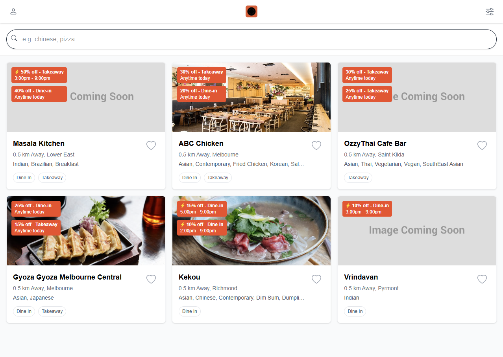
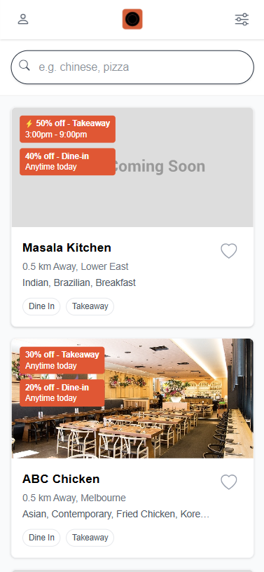
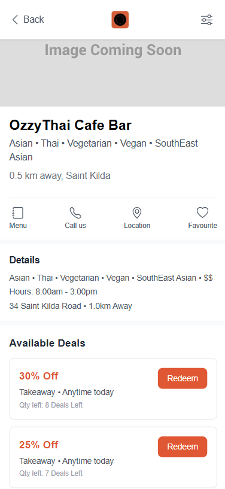

# EatClub Frontend Technical Challenge

This is my submission for the EatClub Frontend Technical Challenge.  
The app is built with **Next.js**, **TypeScript**, and follows an **MVVM architecture**.  
For testing, I used **Jest** and **React Testing Library**.  

---

## Getting Started

Clone the repository and install dependencies:

```bash
git clone <https://github.com/shourya02/eatclub-frontend.git>
cd eatclub-frontend
npm install
```

Run the development server:

```bash
npm start
```

Then open [http://localhost:3000](http://localhost:3000) in your browser.

---

## Features Implemented

### Restaurant List Screen
- Fetches restaurant data from:  
  [https://eccdn.com.au/misc/challengedata.json](https://eccdn.com.au/misc/challengedata.json)
- Displays a list of restaurants as cards.
- Search bar supports filtering by partial name or cuisine.
- Cards are sorted by **best deals first**.
- Responsive layout:
  - Optimized for mobile first.
  - Scales nicely on desktop (grid layout).

### Restaurant Detail Screen
- Shows details for the selected restaurant.
- Displays deal cards, sorted by **highest discount**.
- Handles missing images gracefully with a placeholder (*Image Coming Soon*).
- Back button returns to the Restaurant List view.

---

## Technical Notes & Decisions

### MVVM Architecture
- `models/` → DTOs for Restaurants and Deals  
- `viewmodels/` → Hooks for state management (`useRestaurantsViewModel`)  
- `components/` → UI components like `RestaurantCard`, `DealCard`  
- `app/` → Next.js pages (`/`, `/restaurant/[id]`)  

### Testing
- Used **Jest** + **React Testing Library**.
- Integration tests cover navigation flow:
  - Restaurant list → Restaurant detail.  
  - Restaurant not found fallback.  
  - Deals sorting logic.  

---

## Challenges & Fixes

### Broken Image Links
- Restaurants like **Masala Kitchen**, **Ozzy Thai Café Bar**, and **Vrindavan** had invalid image URLs.
- Implemented a fallback placeholder image (*Image Coming Soon*).

### Deal Time Naming Inconsistencies
- Some restaurants use `start/end`, others use `open/close`.
- Normalized by checking both field sets.

### Data Inconsistencies
- **Vrindavan**: Opening hours are 6PM–9PM, but deal is 3PM–6PM (conflict).  
- **Masala Kitchen**: Deal times & hours both say 3PM–9PM, but `lightning=true` (suggesting "anytime today"). Likely a backend bug.

### Missing Data
- API does not provide `distance` or `priceRange`.  
- Added placeholders in UI with assumption they should come from backend later.

---

## Bonus Features

- Fully responsive design — mobile-first, adapts to desktop.  
- Sorting logic applied consistently (best deals first, highest discount on detail screen). 
- Lightning Deal Indicator: Highlighted specific deals with a time range.

---

## Screenshots






---

## Project Structure

```bash
eatclub-frontend/src
├── app/
│   ├── page.tsx                 # Restaurant List
│   └── restaurant/[id]/page.tsx # Restaurant Detail
│   └── api/route.ts
├── components/
│   ├── RestaurantCard.tsx
│   └── DealCard.tsx
├── models/
│   └── restaurant.ts
├── viewmodels/
│   └── useRestaurantsViewModel.ts
└── __tests__/
    └── components/DealCard.test.tsx
    └── components/RestaurantCard.test.tsx         
    └── integration/RestaurantFlow.test.tsx
    └── viewmodels/useRestaurantViewModel.test.tsx    
```

---

## Next Steps (if I had more time)

- Add comprehensive string localization for multi-language support
- Create a global CSS theme system with design tokens for consistent styling
- Develop dedicated desktop-optimized views for deal displays
- Optimize rendering performance
- Add a service layer abstraction for API calls to improve maintainability and extensibility
